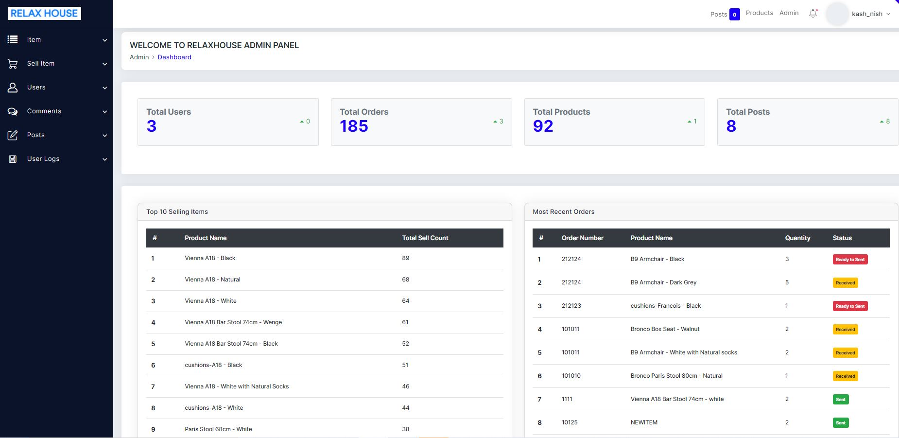
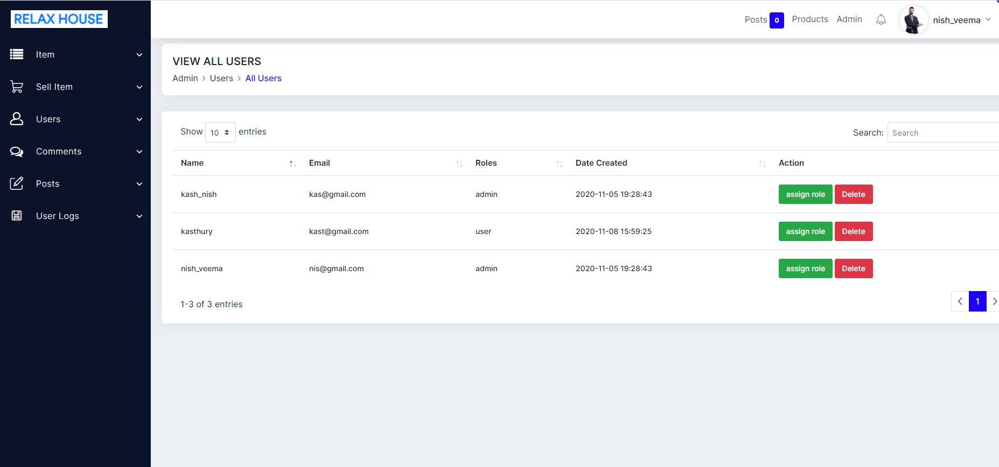

# stock-count-project-laravel

This application will mange the stocks of the products in a warehouse or related work place.  
When I was working at the warehouse, we had to do stock count every week.in order to save time and improve efficiencies instead of using hard copy stock count.
My web application has the following features.
user will be able to view the products and their current stocks. Also, you will be able to see the posts but they need to login to like or comment the posts.
user has to register in order to enter admin panel. However, user roles will be assigned by admin later.
Once a user logged in, they can do following activities.

• user will be notifed if there is any new posts published since they logged. for example, there are 4 new posts posted since they have logged out when they logged in you will be shown 4 posts so that you will knw that there are some new posts and they can view it. 
• User can like or unlike a post and comment on them 
• Add a new protect to the stock 
• edit or delete an existing products 
• everytime they get an order, we will add them in our system with received status. once we add, quatity of that item will be deducted automatically. once we paked the order, we will change the status to 'ready to sent' and we will add the users who packed that order. Also, once the order is sent to the customer, we will change the status to 'sent'  
• In some cases where customer may cancel an order or add or deduct quantity in the existing order.our sytem has the solutions for these scenarios. when they add or deduct quantity or even cancel the orders, all the calculations will be done automatically. for example, when the order is cancelled, quantity of that product will be added to the current stock of that product 
• Also user can see all the orders in a table so that everyone will know whether the order is ready to sent or still it is being packed or sent 
• User can view the order history of an item (whole history or perticular duration) 
• admin user can view and manage(assign role , delete) users 
• admin user can approve or disapprove the comments or even delete those comments 
• admin user can manage(delete , edit) existing posts and other users can only create a post and edit their posts 
• A warning message will appear when a stock count of an item reaches its threshold (50). 
• every activity will be monitored since a user has logged in into the system until log out. However, 
only admin user can view the log history of all users, while others can only view their own history. 
This system is having a message system so that users can talk or pass a notification to others. 
 
• Our system is having a message system so that user can talked to eachother through them. Our message system having following functionalities 
<ul>
  <li>if there is any new messages or has any unread messages, you will be notified when they logg in. so that can go to their inbox to view them </li>
  <li>once they view them then the message will be marked as read automatically. In addtion to that, you will be able to mark any number of messages as read or unread</li>
  <li>once they open the new message, they will have an option to reply or they can even move them to trash. later they can bring them back to inbox from trash or they can delete(when they delete that message wont be deleted permanently as they havent created this message)</li>
  <li> they can sent a message to more than one person at a time</li>
  <li>User can view all the sent messages and resent them to someone else by just clicking the message </li>
</ul>
 
<h2>Developed the system with</h2>
<b>Laravel:- </b>Livewire, Eloquent(Relationships), Database(query builder, migration, pagination), input validation, Middleware, Authentication(Jetstream), Session 
<b>PHP</b> 
<b>HTML</b> 
<b>CSS</b> 
<b>Jquery</b> 
<b>Bootstrap 4</b> 
<b>Mysql</b> 
<b>Bootstrap Theme:-</b>https://github.com/dropways/deskapp 

<h1>Some Screenshots with Explanation</h1>

you can view posts and the products before logged in

 
<h4>Authentication(Jetstream)</h4>
I have used newly introduced Jetstreaam autentication for login, regitration. Also It will provide other nice features like update user information, change password, two factor authentication, forget email, and session management.
By default, in jetstream email and password will be used for login but I have customised it by use username and password for login 

 
By default, In jetstream name, email password for registration. In my project I have added username in the registration page 

 
<h3>Livewire</h3>
When we get an order, it might have more than one products. So, In that cases, user will be able to add more items at once rather than storing one by one in the system. To accomplish this I have used Livewire to accomplished this step. As shown in below image, my clicking ADD PRODUCT button, user will be able to add more items
 

 
 
<h3>Dashboard</h3>

 
<h3>Account Settings</h3>

 
<h3>Update or delete Products</h3>

 
<h3>View all Orders' history</h3>

 
<h3>View all posts</h3>

 
<h3>View all comments</h3>

 
<h3>Message System</h3>

 
<h3>View All Users</h3>

 
<h3>User Logs</h3>

 
<h3>Like , unlike and Comment Posts</h3>

 

